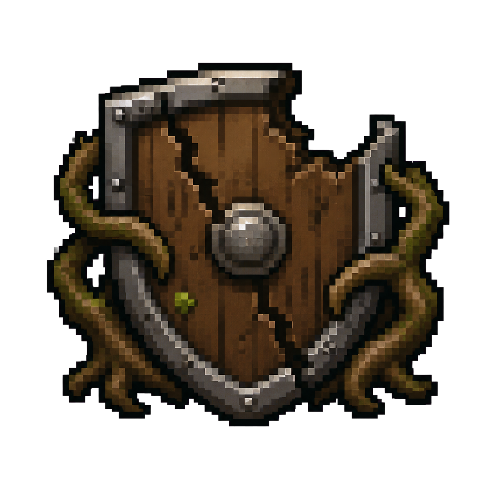
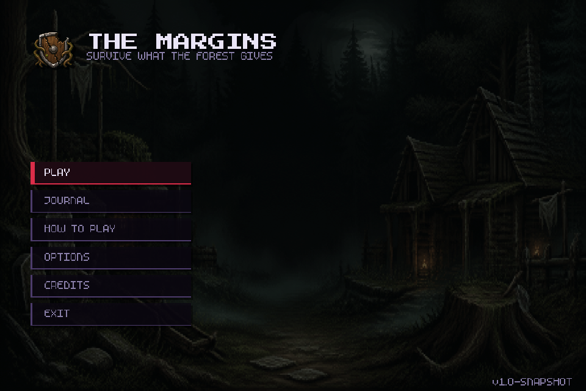
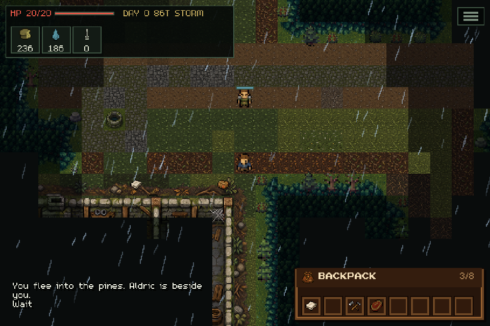
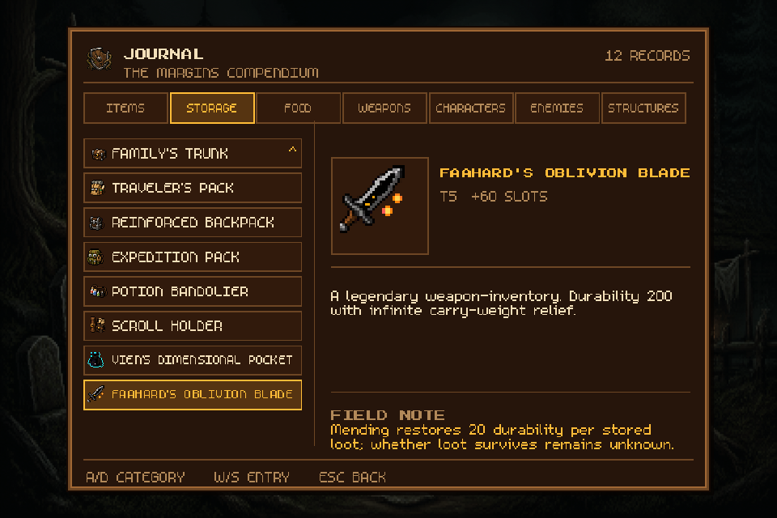

<p align="center">
  
</p>

<h1 align="center">The Margin</h1>

<p align="center">
  <strong>Survive what the forest hides.</strong>
</p>

<p align="center">
  A text-forward, turn-based 2D survival roguelike built with Java 17 and libGDX.
</p>



## About the Game

You are **Klein**, a young Novelborne knight whose quiet border posting ends on the first morning of an Evermove invasion. Stripped of rank, separated from his only surviving comrade, and trapped behind enemy lines, Klein must cross the occupied **Herois** forest and find a way home—to his fiancée, his family, and the ordinary life the war tried to erase.

Every move advances time. Hunger, thirst, exposure, darkness, and changing weather turn the forest into an enemy of its own. Forage and scavenge what you can, purify water, cook food, make camp, and choose your fights carefully: combat is loud, weapons wear down, and every mistake can draw the occupation closer.

Companions can keep Klein alive, but they also need protection and supplies. The bonds formed on the road—and the people lost to it—shape a survival story where the final objective is simple, human, and dangerously far away: **get home**.

*The Margin* is set roughly **50–60 years before** the events of *The Margins*, in the same universe.

## Gameplay

- Explore one continuous, procedurally varied frontier built around fixed story landmarks and 11 discoverable world structures.
- Endure a turn-driven survival simulation with hunger, thirst, temperature, weather, light, food spoilage, and lasting debuffs.
- Evade or confront patrols through field of view, stealth, noise, combat, weapon durability, and repair systems.
- Travel with autonomous companions, issue simple orders, share supplies, build bonds, and live with permanent loss.
- Uncover Herois through a text-forward prologue, diegetic tutorial, dialogue, quests, and an in-game journal.
- Grow through knowledge and practical skill rather than traditional level grinding.

<p align="center">
  
  
</p>

## Development Status

**The game is in active development.** The current playable build includes the continuous world, core survival loop, day/night and weather simulation, combat, world structures, the opening story and tutorial, companions, Bond, and the journal/compendium.

The act-gating story quests, border-crossing ending, and the full inventory and trading economy are still being built. Automated tests cover the headless game systems while the libGDX client provides the playable presentation layer.

## Design Bible

The complete design lives in [`The Margin - Remake/`](The%20Margin%20-%20Remake/). Start with the numbered index:

**→ [`00 - INDEX`](The%20Margin%20-%20Remake/00%20-%20INDEX.md)** — world, protagonist, story, gameplay, and all systems in canonical build order.

## Build and Run

### Prerequisites

- Java 17+
- Apache Maven 3.6+

```bash
# Run the automated test suite
mvn -pl core test

# Compile and launch the desktop game
mvn clean compile exec:java -pl desktop
```

See [`docs/BUILD.md`](docs/BUILD.md) for offline builds, packaging, and troubleshooting.

## Tech Stack

- **Java 17**
- **libGDX 1.12.1** with the LWJGL3 desktop backend
- **Maven**
- **JUnit 5**

---

<p align="center">
  <em>A lost war. A living forest. One way home.</em>
</p>
