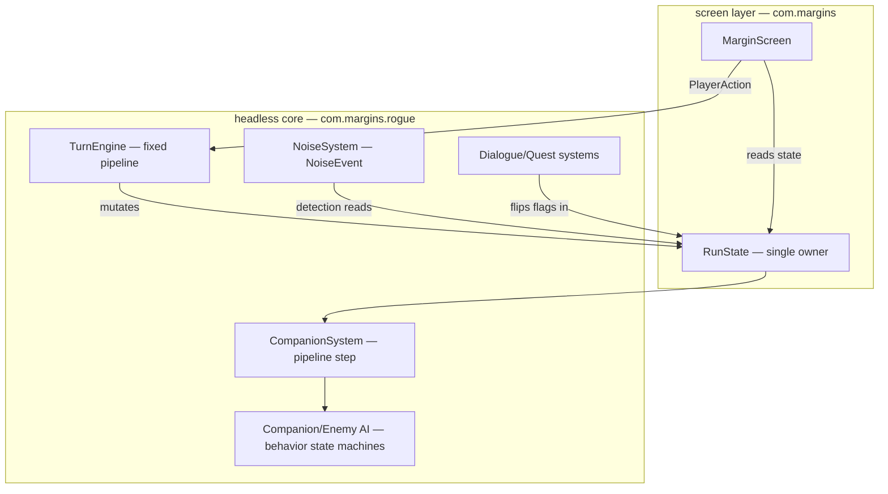

# Architecture Spine — The Margin

## Design Paradigm

**Layered — headless core / render screen.** The game's logic and state live entirely in the **headless core** (`com.margins.rogue`); the **screen layer** (`com.margins`, e.g. `MarginScreen`) is pure presentation over it. The core owns every game rule and every mutable state; the screen only reads state and translates player input into `PlayerAction`s. Nothing in the core may reference a libGDX render or input type (this is already the code's convention — `AD-2`).

The paradigm maps to the codebase as:

```text
com.margins.rogue        ← headless core (all rules + state; no render/input types)
com.margins              ← render screen (reads state, renders, maps input → PlayerAction)
com.margins.desktop      ← platform bootstrap (DesktopLauncher)
core/src/test            ← headless tests (no screen)
```

## Inherited Invariants

None — this is a fresh spine for the Remake (the old Milek/Caravan Road architecture is obsolete). The `AD` numbers below are new and stable; where the existing code already follows a convention, that `AD` is marked `[ADOPTED]` and ratifies it rather than re-deriving it.

## Invariants & Rules



### AD-1 — Layered architecture: headless core owns all rules and state

- **Binds:** all core classes, all screen classes
- **Prevents:** game logic leaking into rendering (or input); a screen that reaches into internals; a core that depends on the screen.
- **Rule:** `com.margins.rogue` owns every game rule and every mutable state. `com.margins` (screen) reads state and emits `PlayerAction`s only. No core type may reference a libGDX render/input type. **`[ADOPTED]`** — the code already follows this.

### AD-2 — Core has no libGDX render types

- **Binds:** all `com.margins.rogue.*`
- **Prevents:** the headless core becoming untestable or unportable; render hacks leaking into logic.
- **Rule:** No core class imports a libGDX render, input, or graphics type (no `com.badlogic.gdx.graphics`, `com.badlogic.gdx.Input`, etc.). `RunState` contains no render types. **`[ADOPTED]`**

### AD-3 — RunState is the single owner of all run data

- **Binds:** `state/RunState.java`; all systems
- **Prevents:** two components holding authoritative copies of run state that could diverge.
- **Rule:** `RunState` owns the tilemap, player, enemies, companions, inventory, floor items, narrative flags (FlagStore), route, seed, RNG, noise queue, and Last-Stand state. Systems mutate it; nothing else holds an authoritative duplicate. **`[ADOPTED]`**

### AD-4 — TurnEngine runs a fixed pipeline in a fixed order

- **Binds:** `system/TurnEngine.java`; all systems
- **Prevents:** systems racing or depending on each other's order; a rule living in the screen.
- **Rule:** `TurnEngine.advance(state, action)` runs the fixed order: PlayerAction → Hunger → Detection → **Companion AI** → Enemy AI (Combat) → Noise resolve → Last Stand → cleanup. No turn rule lives in the screen. The pipeline step is the *entire* companion behavior state machine (AD-10), not the legacy greedy follower. **`[ADOPTED]`** (pipeline shape only — the "Companion follow" step label is superseded by Companion AI per AD-10).
- **Combat resolves at the actor's point in the pipeline, all through `CombatSystem`.** The player's attack applies synchronously at action time (in the PlayerAction step); a companion's **FIGHT** applies during the Companion AI step; enemy attacks apply during the Enemy AI (Combat) step. **A dead agent never acts later in the turn** — an enemy killed by the player's attack is already dead when Detection and Companion AI run, and never reaches the Enemy AI step. No attack is deferred to a single end-of-turn `resolveAll()`. (Ratifies the brownfield: `TurnEngine.java:48` calls `CombatSystem.playerAttack` inside the PlayerAction switch; enemy attacks run in `CombatSystem.enemyPhase`.)

### AD-5 — A turn is committed only when the player acts (survival-clock honesty)

- **Binds:** `TurnEngine`, all survival tracks (Hunger, Thirst, Temperature, Day/Night, Weather), all agents (player + companions)
- **Prevents:** survival meters draining on wasted keypresses; "survival as chores" rather than choice; a companion acting on its own cadence and desyncing the turn economy.
- **Rule:** A keypress into a wall or inert tile commits no turn and ticks no survival clock. Only a real action (move, attack, use, wait, interact) commits a turn. This is the existing `acted=true` behavior — **`[ADOPTED]`**. The whole party shares one turn: **companions act only on a player-acted turn** — never on their own clock, never outside the fixed pipeline (AD-4).

### AD-6 — RunState is serializable via libGDX Json for save/load

- **Binds:** `state/RunState.java`, `save/SaveService.java`
- **Prevents:** save/load breaking as the spine grows; transient fields being persisted by accident.
- **Rule:** `RunState` serializes via libGDX Json; transient fields (route, rng, noise queue, per-turn flags) are re-supplied on load via field initializers / a no-arg constructor. **The tilemap serializes inline under the run root** — it is persistent world state, never regenerated from seed on load (world-gen determinism is not relied upon). **`[ADOPTED]`**
- **The save format is versioned.** `RunState` carries a `saveVersion`. A save whose version predates a breaking-format change (e.g. the AD-8 floor-descent retirement) is **rejected with a clear message, never silently loaded** — libGDX Json silently ignores unknown keys, which would otherwise let a stale `floorDepth` + floor-sized tilemap load "successfully" as the continuous region. Migration policy: pre-AD-8 saves are rejected (permadeath makes a run one life; a stale-world save is not recoverable into the new world), not regenerated.

### AD-7 — Run-scoped narrative state lives in FlagStore + Bond

- **Binds:** `state/FlagStore.java`, narrative systems, quest/act gating
- **Prevents:** narrative decisions (act gates, quest states, dialogue flags) being scattered as ad-hoc booleans.
- **Rule:** All run-scoped narrative state — flags, quest state, act progression, companion Bond — lives in `FlagStore`. Act-gating quests flip flags here; the occupation-escalation ramp reads them. **`[ADOPTED]`** (the prototype already does this — a single Bond key, `bond.galleon`, for its one companion). **Design-forward for the Remake:** Bond becomes **keyed per-companion** (one value per roster member, keyed by `bindId` — the roster is four; a single Bond value would be wrong). Not yet in the code.

### AD-8 — The persistent map is one continuous tiled Herois region; floor-descent is retired

- **Binds:** `FloorGenerator`, `RogueTileMap`, world generation, `RunState`, `TurnEngine`, `Route`
- **Prevents:** a tilemap that can't express the east/west danger gradient; a sub-area map that fragments the persistent-Herois premise; the ratified floor-descent machinery silently surviving and contradicting the premise.
- **Rule:** Herois is **one continuous tiled region** — fixed canon landmarks (Corneo, the Copper Road, the NW border crossing, the Watchtower) with procedural wilderness between them. Danger rises east toward the invasion; safety lies west toward the border. Connected sub-areas are rejected.
- **This is the ONE breaking deviation from the ratified brownfield.** The descent machinery is retired with this AD and must not be preserved or adapted:
  - `RunState.descend()`, `RunState.floorDepth` (+ `getFloorDepth`/`setFloorDepth`), the `Route` floor-list model (`getFloorCount` — the Caravan Road's 3 floors), `RogueTile.STAIRS_DOWN/STAIRS_UP` (walkable stairs), `FloorGenerator.generate(width, height, rand, floorDepth)`'s per-floor BSP output, and the `TurnEngine` STAIRS_DOWN descent trigger (`TurnEngine.java:120`).
  - Replacement: `FloorGenerator` generates one continuous region (landmarks stitched with procedural wilderness — the stitch detail is deferred to the world-gen epic); `Route` becomes landmark geography, not floors; `RunState` drops `floorDepth`/`descend()`. Descent triggers are removed from `TurnEngine`. Everything else the spine `[ADOPTED]` (AD-3 state ownership, AD-4 pipeline, AD-6 serialization) is ratified **as of this migration**. The continuous tilemap serializes **inline** (AD-6) — it is not regenerated on load, so world-gen determinism is not required.
  - Survival tracks, companions, and enemies are unaffected — they cross this map like any SPD-style tilemap; "floor" as a difficulty dimension is replaced by the spatial danger gradient (the map's *raison d'être*).

### AD-9 — Noise is an event (NoiseEvent) that feeds detection; it never touches actors directly

- **Binds:** `NoiseEvent`, `NoiseSystem`, `DetectionSystem`
- **Prevents:** actors being steered by noise directly; detection bypassing the noise→detection chain.
- **Rule:** Emitters (combat, distraction) put `NoiseEvent`s into a per-turn queue on `RunState`; **`NoiseSystem.resolve` is the queue's single consumer** — it nudges enemy state centrally (UNAWARE→SUSPICIOUS, retarget `lastSeen`, reset `calmTurns`). Vision-based escalation is a separate, FOV-driven pipeline (`DetectionSystem`, AD-18). No code that emits a noise reaches into an enemy because of it. **`[ADOPTED]`** (this is the actual code: `NoiseSystem.resolve` at `NoiseSystem.java:22-39`, enqueue via `RunState`). *Design-forward gap:* player **movement** does not emit noise yet — only combat and distraction do. The Remake adds movement noise; FR-17's party-stealth penalty rides this same channel.

### AD-10 — A companion is a full tile-agent with a behavior state machine

- **Binds:** `Companion.java`, `CompanionSystem`, companion AI, FR-15/16/17
- **Prevents:** a companion that is "just following the player" (the current `followStep` follower), which fails FR-15/16 and the help-and-liability design.
- **Rule:** Each companion is a full tile-agent: own Status block, own HP pool, own condition/debuff state, own survival tracks (hunger, thirst, cold — FR-15 "share the survival pressure like any body"), and a behavior state machine (**FOLLOW / HOLD / HIDE / DISTRACT / FIGHT / RETREAT / FLEE**). Combatants (Aldric) and non-combatants (Mara, Old Fen, Yenna) differ by behavior set, not entity depth. Greedy follow is a fallback, not the model. Simple orders (hide/hold/distract) steer the state machine. Companions obey the same detection/noise rules as enemies — they can blow the player's stealth.
- **Combat has one authority over ALL three HP pools.** `CombatSystem` is the single owner of *combat damage* to the player, companions, and enemies alike. A companion's **FIGHT** issues actions through `CombatSystem` — the same mutation path the player uses — and never mutates any HP directly. No second owner of combat damage exists for enemy, companion, *or* player HP. The survival tracks (hunger, thirst, cold) are a **distinct, named channel**: they drain HP via their own pipeline step (AD-4's Hunger step) with explicit rules, not via a second combat mutator. Companion/player HP are not left to any ad-hoc system.
- **The state machine is persistent state.** A companion's current behavior and target serialize with the companion (AD-6), so save/load resumes mid-behavior — a companion hiding when saved is still hiding when loaded.
- **Identity is keyed, not positional.** Companions are keyed by `bindId` (and roster slot by name, not list index); party logic never references "companion at index 0."
- **Only the active companion is a positioned tile-agent.** Off-party roster members (the other three of four) are **abstract `FlagStore`/Bond entries** — narrative state, not bodies on the map: they occupy no tile, emit no noise, and their survival doesn't tick until they're active (or holdout support is engaged). A companion being "off the map" is a state transition, not a hidden on-map entity.
- **The party-stealth penalty is noise, not a modifier.** FR-17's "companions add a noise penalty to stealth" is expressed as `NoiseEvent`s emitted at the companion's position when it moves or acts (AD-9) — the companion is a body making noise, and `NoiseSystem.resolve` consumes it like any other noise. No static modifier on DetectionSystem.

### AD-11 — Act-gating quests flip narrative flags; acts escalate the occupation

- **Binds:** Quest/Dialog systems, FlagStore, occupation escalation, FR-18
- **Prevents:** act boundaries leaking into mechanics; act-gating as a hard floor-check.
- **Rule:** Main-story quests gate Act 1→2→3 via the Dialog/Quest systems. **"Follow the Road"** (reach the Copper Road corridor) gates 1→2; **"The Rescue"** (reach/attempt Aldric's prison; success or failure both turn) gates 2→3. Quest completion flips `FlagStore` flags; the occupation-escalation ramp reads those flags. **The escalation trigger is story-flags, not an occupation-timer or exploration counter** — resolves the PRD's open escalation-trigger question.
- **The ramp has TWO channels — they must not be merged.** (a) **Off-border presence thickens per act**: eastward Giliman patrols, garrisons, and reinforcement density rise with act. (b) **The NW border cordon is a distinct output that THINS as acts advance** — the war consolidates east, drawing occupiers off the border. The cordon's garrison scales with story flags (a *subset* of the flags the off-border ramp reads), not act index alone. AD-12's win gate consumes channel (b) and is survivable by Act 3; channel (a) is what makes the *rest* of Herois more dangerous. A uniform multiplier applied to all Giliman including the cordon is **wrong** — it would harden the win gate each act and invert the "home close enough to taste, lethal to reach" premise.

### AD-12 — The border crossing is the win; a final tense run, not a boss

- **Binds:** Act 3, the NW border crossing, FR-18, the occupation-escalation ramp (AD-11)
- **Prevents:** a boss-duel climax that contradicts the "escape, not a duel" design and the small-human-goal thesis; a win gate that lies to the player with an invisible wall.
- **Rule:** The win is **reaching the NW border tile and surviving a final tense run** — a scripted escape-run over a bounded number of turns, ending in the crossing. The Deep Cave Mouth is a separate Region-2 threshold, NOT the exit.
- **The gate is spatial state, not a locked door.** The border is *always physically walkable* — the game never lies with an invisible wall (permadeath honesty). What makes a day-1 west sprint suicidal is that the crossing is a **defended Giliman cordon** whose strength is channel (b) of the occupation-escalation ramp (AD-11): fully staffed in Act 1 (near-certain death), thinning as the war consolidates east. The final run is the moment the cordon is *survivable with Act-3 readiness*: a scripted gauntlet gated on story state + preparation, reached after the last provisioning push. "Home is close enough to taste and lethal to reach" is literal game state, not narrative color.

### AD-13 — Gear-with-memory: repairs permanently lower max durability (SKILL-modified)

- **Binds:** `Weapon System`, `Inventory`, FR-13
- **Prevents:** gear feeling infinite; the horizontal-progression philosophy being undermined by grindable gear.
- **Rule:** Each repair restores durability but permanently lowers max (decay curve: Fresh 100% → 1st 90/93/96 → 2nd 78/84/91 → 3rd 65/74/85 → 4th 50/63/78 → 5th 35/51/70 → 6th+ beyond repair, values per Low/Mid/High SKILL). Repair is SKILL-based, using weapon-specific materials. This is the hard ceiling on how much fighting any one weapon can endure.

### AD-14 — Act 0 (text intro + diegetic tutorial) lives in the core, presented by the screen

- **Binds:** `MarginScreen`, the text intro, Aldric's tutorial, FR-1/2
- **Prevents:** the intro being a render-only special case that breaks headless testability; intro screens accidentally ticking survival tracks.
- **Rule:** Act 0 is a core-owned sequence (the skippable text intro + Aldric's diegetic tutorial) presented by the screen. Intro screens commit no turn and tick no survival clock (AD-5). A "skip" path exists on every intro screen and skips to gameplay in one action. **Dialogue is a safe pause too:** any open text surface (intro, dialogue tree, quest log) commits no turn and ticks no survival clock; the turn economy resumes only when the surface closes — a dialogue choice may commit the turn it resolves, but never a survival tick while reading.

### AD-15 — SPD-style presentation is a ratifying constraint

- **Binds:** `MarginScreen`, all rendering, FR-NFRs (PRD §4.7)
- **Prevents:** the presentation lock drifting into non-SPD mechanics (real-time, 3D, heavy HUD).
- **Rule:** The SPD-style presentation lock is a system-wide constraint: 2D top-down tile-based only (no 3D, no camera tricks); turn-based, tile-by-tile (no real-time); the bottom message log is the primary text surface; the HUD is minimal. Placeholder colors are acceptable pre-art.

### AD-16 — Performance budget: one turn renders and pathfinds without perceptible stutter

- **Binds:** `MarginScreen`, `FloorGenerator`, `RogueTileMap`, the persistent map (AD-8)
- **Prevents:** the persistent Herois map degrading the turn loop as it grows; the "perceptible stutter" budget going undefined.
- **Rule:** The persistent map must render and pathfind within a single turn without perceptible stutter on mid-range desktop hardware. A performance test is required before the world-gen epic ships and must cover the **worst case, not just the happy path**: the whole-party shared turn (AD-5) at maximum agent count — full party (up to 4 companions) + a dense eastern garrison — including per-agent FOV (AD-18, acting-agent cadence), enemy AI, and detection, not merely render/pathfind. If the worst case exceeds the budget, the FOV-caching or agent-culling strategy is revised before the epic ships.

### AD-17 — The economy is scarce; scarcity drives the foray loop

- **Binds:** `rogue/item/*`, traders, currency (FR-20/21), repair materials (AD-13)
- **Prevents:** an economy that lets the player buy their way out of the survival loop; a coin glut that collapses the east-toward-danger tension.
- **Rule:** Currency is a **scarce, finite resource** — Klein cannot grind money into safety. The two traders buy at a loss and sell at a premium; coin has weight pressure (the FR-21 coin-stack/compression decision stays deferred, but weight pressure itself is real). Repair materials compete with trade on the same scarcity (AD-13). No infinite-money loop exists. The scarcity is what keeps every foray an eastward gamble, and the economy is always *worse* for Klein than foraging — it converts surplus into readiness, never into safety.

### AD-18 — FOV and light are core mechanics, not presentation

- **Binds:** `DetectionSystem`, FOV, day/night, weather, light sources (campfire, torch)
- **Prevents:** FOV being treated as a render-layer nicety; night becoming a cosmetic tint instead of a survival dimension.
- **Rule:** Field-of-view is a **core mechanic owned by the core** (AD-1): the same FOV *rules* govern the player, companions, and enemies symmetrically — but **FOV is computed only for the acting agent per pipeline step** (or cached across a turn), never recomputed for every agent every turn on the continuous map. Enemy detection keeps the cheap LOS-to-player check (brownfield `DetectionSystem`). This keeps turn cost bounded as the party and the eastern garrison grow (AD-5's whole-party turn, AD-16). Night and weather **shrink visible radius**; a light source (campfire, torch) restores the *player's* visible radius. **Light alerts enemies through exactly ONE mechanism — the AD-9 noise channel.** A lit source (campfire, torch) emits a per-turn `NoiseEvent` at its tile, consumed by the AD-9 Noise step; this **ignores LOS** (noise is positional — an enemy behind a wall hears the fire, exactly like an AD-10 companion's noise). It does *not* separately make lit tiles visible to enemy FOV. Night is a survival dimension — darkness hides Klein from patrols *and* patrols from Klein — never a render filter.

## Consistency Conventions

| Concern | Convention |
| --- | --- |
| Naming | `Rogue`-prefix for core tile entities (`RoguePlayer`, `RogueEnemy`, `RogueTile`); `System`-suffix for turn-pipeline systems; `state/` for run-scoped state; `system/` for systems; `item/` for inventory items |
| Data & formats | Run state via `RunState` (AD-3); narrative flags via `FlagStore` (AD-7); noise via `NoiseEvent` (AD-9); survival tracks are ints in turns/tiers |
| Stats & status | **Design target (Remake, from the bible):** six-stat block (STR / GRIT / INS / AG / VOICE / SKILL) on `RoguePlayer`/`Companion`; **SKILL is the horizontal-progression axis** (no combat XP) — it modifies repair (AD-13) and stealth rolls. **Current code (prototype):** `RoguePlayer` carries four (STR / INSTINCT / GRIT / VOICE — no AG, no SKILL); `Companion` has no stat block. AG/SKILL and companion stat granularity are design-forward — see Deferred. Debuffs (Wounded, Hungry, Thirsty, Cold, Trembling) are a closed shape on each entity's Status block; no ad-hoc status flags |
| State & cross-cutting | Single mutation path: `TurnEngine.advance` → systems → mutate `RunState` (AD-3, AD-4); serialization via libGDX Json (AD-6); RNG is seeded in `RunState`, all randomness flows through it |

## Stack

*Seed — verified current at authoring (2026-08-06, Maven Central); the code owns this once it exists.*

| Name | Version |
| --- | --- |
| Java | 17 (LTS) — set via `<java.version>` in `pom.xml` |
| libGDX (`com.badlogicgames.gdx:gdx`) | 1.12.1 (project-pinned, `${gdx.version}`) |
| libGDX desktop backend | `gdx-backend-lwjgl3` 1.12.1 |
| libGDX platform natives (desktop) | `gdx-platform:natives-desktop` 1.12.1 |
| JUnit Jupiter (tests) | 5.10.2 |
| Maven build plugins | `maven-compiler-plugin` 3.11.0, `maven-surefire-plugin` 3.2.5, `exec-maven-plugin` 3.1.0 |

*Verified against `pom.xml` + module poms (2026-08-06): these are the only versions the build actually declares. Earlier drafts wrongly listed Mockito/AssertJ — **neither is a dependency, and no test source uses them**; test isolation relies on JUnit alone. libGDX latest is 1.14.2 (Maven Central); the project pins 1.12.1 (working brownfield). **Stay on 1.12.1; bump deferred** — see Deferred.*

## Structural Seed

```text
core/src/main/java/com/margins/
  rogue/                  # headless core — all rules + state
    state/RunState.java   # single owner of run data (AD-3)
    system/               # TurnEngine + pipeline systems (AD-4)
    Companion.java        # full tile-agent (AD-10)
    RoguePlayer/RogueEnemy/RogueTileMap/...
  MarginScreen.java       # render screen — reads state, maps input (AD-1)
  MarginsGame.java        # entry point
desktop/src/main/java/com/margins/desktop/DesktopLauncher.java  # bootstrap
```

## Capability → Architecture Map

| Capability / Area | Lives in | Governed by |
| --- | --- | --- |
| Act 0 intro & tutorial (FR-1..3) | `rogue/narrative/*`, `com.margins/MarginScreen` | AD-14, AD-5 |
| Turn & survival core (FR-4..8) | `rogue/system/*`, `rogue/state/RunState` | AD-1, AD-3, AD-4, AD-5, AD-6 |
| Foray & world (FR-9..11) | `rogue/FloorGenerator`, `rogue/RogueTileMap` | AD-8 |
| Combat & gear (FR-12..14) | `rogue/system/CombatSystem`, `rogue/RoguePlayer` | AD-9, AD-13 |
| FOV / light (night, weather, torches) | `rogue/system/DetectionSystem`, FOV | AD-18 |
| Story/people/companions (FR-15..19) | `rogue/Companion`, `rogue/narrative/*` | AD-7, AD-10, AD-11 |
| Inventory/currency (FR-20..21) | `rogue/item/*` | AD-13, AD-17 |
| Presentation (SPD lock) | `com.margins/MarginScreen` | AD-1, AD-2, AD-15 |
| Performance (persistent map) | `MarginScreen`, `FloorGenerator`, `RogueTileMap` | AD-16 |

## Deferred

- **libGDX 1.12.1 → 1.14.2 bump** — deferred. The pinned 1.12.1 works; bumping is a migration with risk and no feature payoff now. Revisit when a specific need arises (e.g., a fix or feature only in a newer libGDX).
- **Continuous vs sub-areas** — *resolved toward continuous* (AD-8). The implementation detail of *how* procedural wilderness is stitched around fixed landmarks is deferred to the epics/stories for world generation.
- **Companion stat granularity** — deferred. Whether a companion carries the full six-stat block (STR/GRIT/INS/AG/VOICE/SKILL) or a role-relevant subset is an open item for the companion story/epic, not an architecture invariant.
- **Combat/stealth numbers** — deferred (per PRD §8/Q6). No damage/HP/accuracy numbers are locked; the calibration is a Phase 2–3 tuning pass.
- **Run length** — deferred (per PRD §8/Q7). ~3–6 in-game days / ~4–8 real hours is a derived starting target, not a commitment.
- **Copper Road towns visitable or off-map** — deferred to the world-gen epic.
- **Companion death (FR-15)** — whether a companion can truly die (vs. only be captured or leave) is a story-scope decision, not an architecture invariant; deferred to the companion epic.
- **Failed Last-Stand roll (FR-14)** — whether a failed Last-Stand check also consumes the once-per-run reprieve is a tuning decision; deferred to the combat-balance pass.
- **Coin stack/compression (FR-21)** — whether 100 Copper = 1 weight or 1:1 physical is an inventory-design decision; deferred to the inventory/currency epic.
- **Party size (FR-17)** — one active companion recommended; whether 2 or a holdout node is allowed is a companion-scope decision; deferred to the companion epic.
- **Rescue-Aldric outcome (FR-3/18)** — always rescuable / always lost / player-determined is a story decision; deferred to the story pass.
- **What-if branch / Region-2 extensibility** — the Ant and Buried Truth branches, and Region 2 via the Deep Cave Mouth, must be *supported without a rewrite* (FR-11, PRD §5). The architecture enables this: FlagStore (AD-7) carries narrative state, RunState (AD-3) is the single serializable owner, and the layered core (AD-1) keeps the render layer swappable — but no branch/region is built now. A later spine update will extend as they're built.
