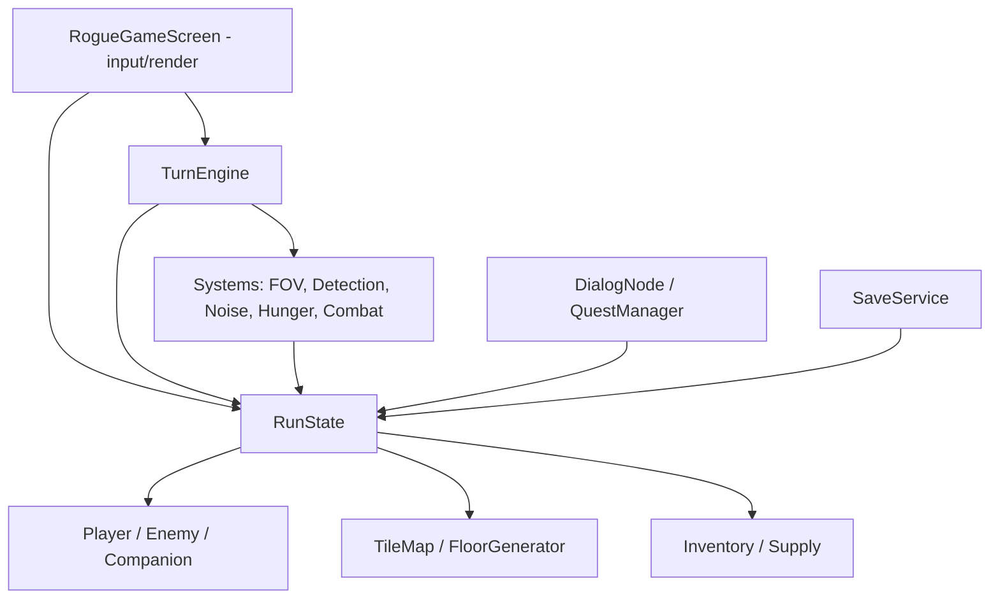

# Architecture Spine — The Margins MVP

## Design Paradigm

**Layered turn-pipeline over a single mutable `RunState`.** Two layers, one-way dependency:

- **Model** (`com.margins.rogue.state`, `.system`, `.entity`, `.world`, `.item`, `.narrative`, `.save`) — all game data and rules. No libGDX rendering types (`SpriteBatch`, `Screen`, `ShapeRenderer`) appear here. Headless-testable.
- **Screen** (`com.margins.rogue.RogueGameScreen`) — input and rendering only. Reads `RunState`, issues player intents to the model, draws the result.

A **turn** is a pipeline: the Screen submits one player action; the `TurnEngine` runs ordered **systems** against `RunState`; the Screen re-renders. Every new mechanic is a system or a field on `RunState`, never a branch inside the Screen.

## Invariants & Rules

### AD-1 — Live code home; legacy frozen `[ADOPTED]`
- **Binds:** all
- **Prevents:** new work landing in dead overworld code
- **Rule:** All MVP code lives in `com.margins.rogue.*` subpackages. The legacy packages `entity/`, `map/`, `screen/` (overworld `GameScreen`/`TitleScreen`), and `fx/` are frozen — not extended, not depended on by new code.

### AD-2 — Model ⟵ Screen layering
- **Binds:** all
- **Prevents:** the 303-line `RogueGameScreen` absorbing nine new systems; untestable rules welded to rendering
- **Rule:** No game rule may live in `RogueGameScreen`; it only reads state, forwards player intents, and draws. Model classes must not import libGDX rendering types. Dependencies point Screen → Model only.

### AD-3 — `RunState` is the single owner of run data
- **Binds:** all
- **Prevents:** two-owner divergence; save/load reading stale duplicates
- **Rule:** One `RunState` instance owns tilemap, player, enemies, companion, inventory, identify-map, flag/Bond store, seed, hunger, HP, `lastStandUsed`, and current floor index. Systems mutate `RunState`; no other object holds authoritative duplicate state. `RunState` is the unit of save (AD-6).

### AD-4 — Ordered turn pipeline
- **Binds:** FR-3, FR-4, FR-5, hunger, combat, FR-14
- **Prevents:** ad-hoc turn-ordering bugs as systems multiply
- **Rule:** `TurnEngine.advance(playerAction)` runs systems in fixed order: **PlayerAction → Hunger → Companion+Enemy AI (Detection update) → Noise resolve → cleanup/flags**. A new mechanic inserts as an ordered system; it is never inlined into input handling or rendering.

### AD-5 — Single seeded RNG
- **Binds:** FR-11, combat, floor generation
- **Prevents:** non-reproducible runs; save/reload desync from divergent random streams
- **Rule:** `RunState` owns one seeded `Random`, seeded per Run. All randomness (floor gen, identify-by-use binding, dodge, spawns) draws from it. No class calls `new Random()` for gameplay. (Corrects existing scattered `new Random()` usage.)

### AD-6 — Save = serialize whole `RunState`, one slot
- **Binds:** FR-20, FR-21
- **Prevents:** replay-based save brittleness when rules change
- **Rule:** Saving serializes the entire `RunState` to a single slot via libGDX `Json`; loading deserializes it. True death deletes the slot. No seed+action-log replay.

### AD-7 — Narrative state lives in `RunState`
- **Binds:** FR-6, FR-7, FR-8, FR-15
- **Prevents:** flags/Bond scattering across objects and escaping the save unit
- **Rule:** Run-scoped flags and Galleon's Bond live in a key/value store on `RunState`. `DialogNode`/`QuestManager` read and write narrative state only through that store.

### AD-8 — Deterministic INSTINCT checks
- **Binds:** FR-7
- **Prevents:** authored beats behaving randomly / unreproducibly across save-reload
- **Rule:** An INSTINCT Check resolves as a deterministic threshold compare (`player.instinct >= node.threshold`), not a dice roll.

### AD-9 — Radius-based Detection + Noise queue
- **Binds:** FR-3, FR-4, FR-5
- **Prevents:** incompatible enemy-awareness implementations; unmanaged noise side effects
- **Rule:** Detection uses an omnidirectional radius gated by line-of-sight — no directional vision cones in MVP. Each enemy holds a `Detection` enum (Unaware/Suspicious/Alerted). Noise is transient events on a `RunState` queue, produced by systems/abilities and consumed on the AI system's tick.

### AD-10 — Companion as an allied turn actor
- **Binds:** FR-13, FR-14
- **Prevents:** Galleon being special-cased into the Screen
- **Rule:** Galleon is a `RunState` entity in its own list, implementing the same tile-actor turn contract as enemies but allied; it runs inside the turn pipeline. Distraction emits a Noise event (AD-9); it does not directly manipulate enemies.

### AD-11 — Story Floor is a fixed authored layout
- **Binds:** FR-18, FR-19
- **Prevents:** the reunion beat being at the mercy of procedural generation
- **Rule:** `FloorGenerator` gains a "fixed" mode that loads a hand-authored layout for the Story Floor; procedural BSP is used only for Floors 1–3.

### AD-12 — Identify-by-use binding on `RunState`
- **Binds:** FR-9, FR-10, FR-11, FR-12
- **Prevents:** per-item identity divergence; inconsistent inventory model
- **Rule:** `RunState` holds a `SupplyType → TrueIdentity` map built from the seed RNG at Run init, plus an `identified` set. Identity is per-type-per-seed, so the existing stackable type/count `Inventory` model is ratified rather than replaced.

### Dependency direction



## Consistency Conventions

| Concern | Convention |
| --- | --- |
| Naming | Live game classes prefixed `Rogue*` where they already are (`RoguePlayer`, `RogueEnemy`, `RogueTileMap`); new systems named `*System` (`FovSystem`, `DetectionSystem`); one class per file, package-by-feature under `rogue/`. |
| Coordinates | Integer `tileX`/`tileY`; grid is `[x][y]`; tile constants in `RogueTile`. |
| Turn actor | Allied and hostile actors expose a uniform per-turn method (extend the existing `RogueEnemy.takeTurn()` pattern into a shared contract); the `TurnEngine` drives them — actors never advance themselves. |
| Randomness | Draw only from `RunState`'s seeded RNG (AD-5). |
| Narrative/flags | Read/write via the `RunState` flag store only (AD-7); flag keys are stable string constants. |
| Save format | libGDX `Json` over `RunState`; fields serialized directly — avoid storing libGDX rendering handles in model objects so state stays serializable (AD-2, AD-6). |
| Serialization root | `RunState` is the *only* serialization root. Entities hold no serialized back-references to `RunState`-owned aggregates (the tilemap, the seeded RNG) — those are transient/injected and re-wired on load. Prevents the map/RNG being double-serialized or forked when `RoguePlayer`-style back-refs (which exist today) are persisted. |
| Layer purity | No `SpriteBatch`/`Screen`/`ShapeRenderer`/`Texture` references in model packages; `Assets`/textures resolved in the Screen at render time. |

## Stack

*Inherited from the existing `pom.xml` — ratified, not newly chosen.*

| Name | Version |
| --- | --- |
| Java | 17 |
| libGDX | 1.12.1 |
| LWJGL | 3 (desktop backend) |
| Maven | multi-module (`core` + `desktop`) |

## Structural Seed

New and refactored source under `core/src/main/java/com/margins/rogue/`:

```text
rogue/
  RogueGameScreen.java     # SCREEN: input + render only (slimmed from 303-line monolith)
  state/
    RunState.java          # single owner of all run data; the save unit (AD-3)
    FlagStore.java         # run-scoped flags + Bond kv store (AD-7)
    IdentifyMap.java       # SupplyType -> TrueIdentity + identified set (AD-12)
  system/
    TurnEngine.java        # ordered pipeline driver (AD-4)
    FovSystem.java         # shadowcasting visible/explored (FR-1/2)
    DetectionSystem.java   # enemy Detection state machine (FR-3/4)
    NoiseSystem.java       # noise queue resolve (FR-5)
    HungerSystem.java      # existing hunger tick, moved out of the Screen
    CombatSystem.java      # existing armor/dodge/block, moved out of the Screen
  entity/
    TileActor.java         # shared turn-actor contract (allied + hostile)
    RoguePlayer.java       # (existing, +facing/stats already present)
    RogueEnemy.java        # (existing, + Detection enum)
    Companion.java         # Galleon: follow + Distraction (AD-10)
  world/
    RogueTileMap.java      # (existing) + per-tile visible/explored bits (FR-1/2)
    RogueTile.java         # (existing constants)
    FloorGenerator.java    # (existing BSP) + fixed-layout mode (AD-11)
    Route.java             # floor sequence: 3 BSP + 1 Story Floor (FR-18)
  item/
    Inventory.java         # ratify existing type/count model (AD-12); backpack + equipped slots (FR-9)
    Supply.java            # supply types + possible true identities (FR-11)
  narrative/
    DialogController.java  # suspends turn processing, drives DialogNode, INSTINCT checks (FR-6/7)
    (reuse) com.margins.dialog.DialogNode, com.margins.quest.QuestManager  # read/write via FlagStore
  save/
    SaveService.java       # Json serialize/deserialize RunState, single slot (AD-6)
```

## Capability → Architecture Map

| Capability / FRs | Lives in | Governed by |
| --- | --- | --- |
| FOV / fog (FR-1/2) | `system/FovSystem`, `world/RogueTileMap` | AD-2, AD-4 |
| Stealth / Detection / Noise (FR-3/4/5) | `system/DetectionSystem`, `system/NoiseSystem`, `entity/RogueEnemy` | AD-4, AD-9 |
| Dialogue / INSTINCT / flags (FR-6/7/8) | `narrative/DialogController`, `state/FlagStore` | AD-7, AD-8 |
| Inventory (FR-9/10) | `item/Inventory` | AD-12 |
| Identify-by-use (FR-11/12) | `state/IdentifyMap`, `item/Supply` | AD-5, AD-12 |
| Companion Galleon (FR-13/14/15) | `entity/Companion`, `state/FlagStore` | AD-10, AD-7 |
| Last Stand / permadeath (FR-16/17) | `system/CombatSystem`, `state/RunState` | AD-3, AD-4 |
| Route / Story Floor (FR-18/19) | `world/Route`, `world/FloorGenerator` | AD-11 |
| Save / continue (FR-20/21) | `save/SaveService`, `state/RunState` | AD-3, AD-6 |

## Deferred

- **Full de-monolithing of rendering/HUD** — extract input+turn logic first (AD-2); the render/HUD internals of `RogueGameScreen` can be tidied later without violating the spine.
- **True ECS** — lightweight systems over plain entities are enough at this scale; a component framework is not adopted.
- **Vision cones / directional stealth** — deferred behind AD-9 radius model; revisit if stealth needs more depth post-MVP.
- **Multi-slot saves, save-scum defense** — single slot only (AD-6).
- **All Vision-tier systems** (Trust Meter, full roster, Alpha/Life-Thread, endings, literacy, factions, alchemy, shops, sound, mobile) — out of MVP per PRD §5.
- **Art pipeline** for unique sprites (Milek/Galleon/scavenger) — a non-code workstream, tracked in the PRD addendum; not governed by this spine.
